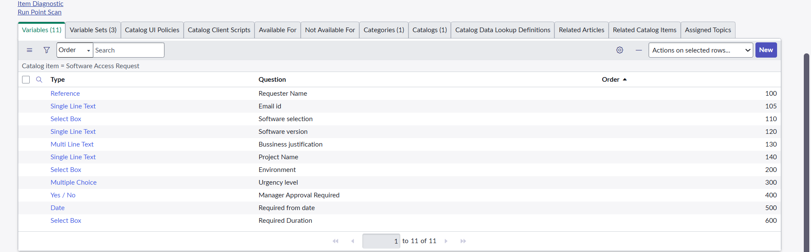
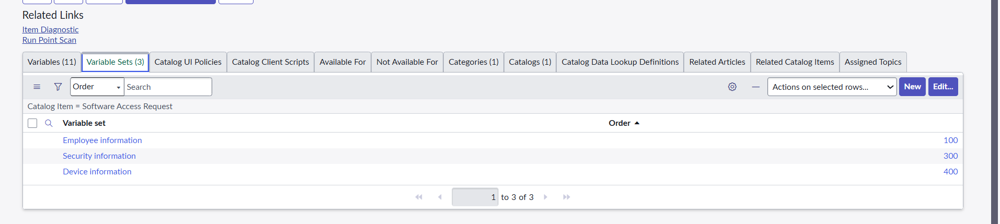
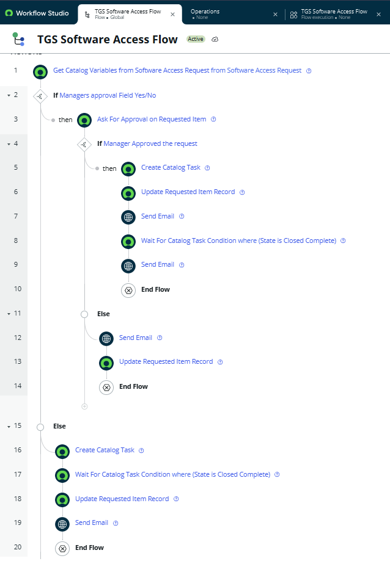
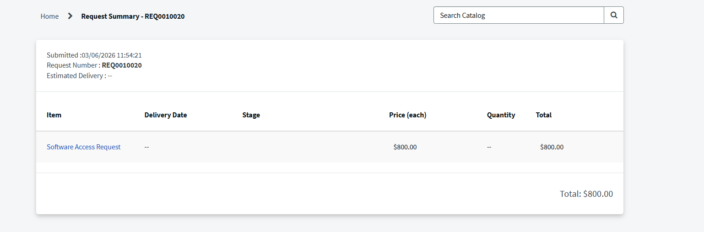
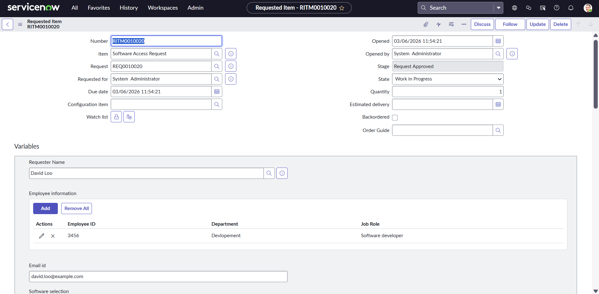
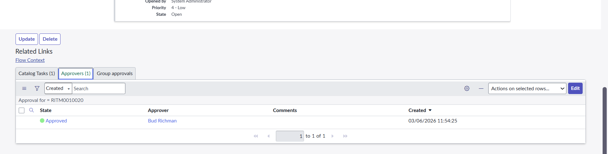
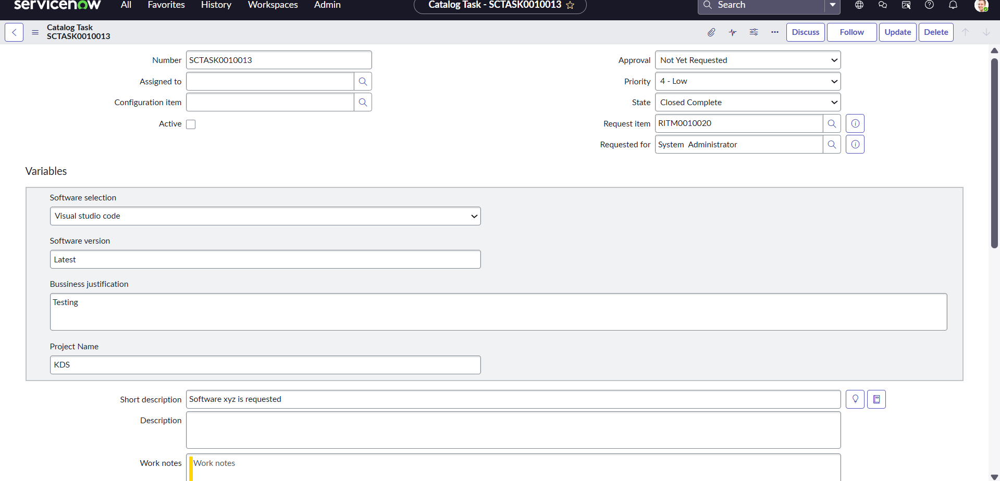
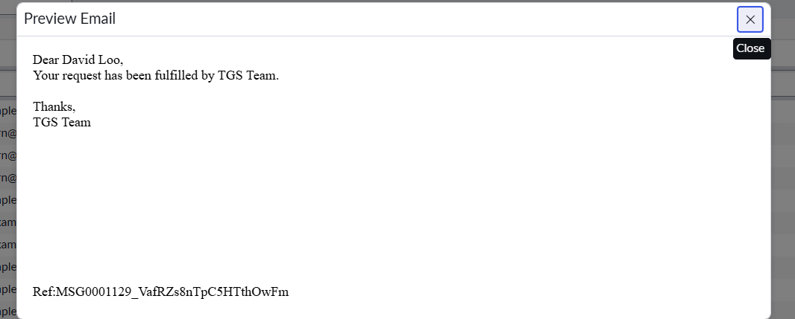
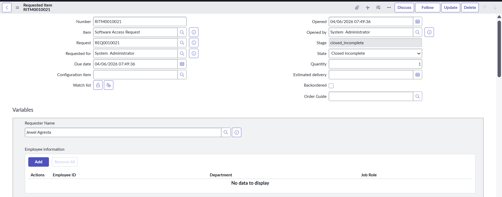
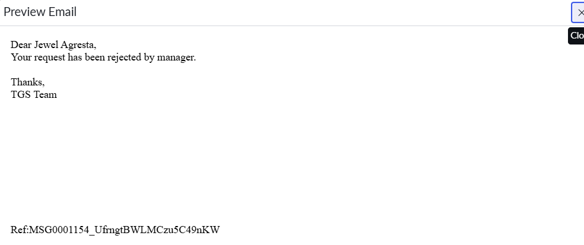

# Project 3: Service Catalog Automation using Flow Designer (End-to-End Approval Workflow)

## Problem Statement

IT teams manually handle software access requests which can lead to delays, missed approvals, and limited visibility into the approval and fulfillment process.

## Overview

Built an end-to-end ServiceNow Service Catalog solution that automates the full lifecycle of a software access request from submission and manager approval to IT fulfillment and completion notifications using Flow Designer.

## Features

* Built Service Catalog hierarchy:
  Service Catalog → Software Services → Software Access → Software Access Request
* Created a catalog item with 11 variables to capture request details
* Used 3 Variable Sets to organize Employee, Security, and Device information
* Implemented a Manager Approval Required (Yes/No) variable to drive workflow decisions
* Automated approvals, task creation, notifications, and request tracking using Flow Designer
* Handled three request outcomes:

  * No approval required
  * Approved
  * Rejected

## Flow Logic

* RITM is created when the request form is submitted
* Flow checks whether Manager Approval is required

* If Yes:
  * Send approval request to manager
  * If Approved:
    * Create Catalog Task
    * Send notification email
    * Wait for task completion
    * Send final completion email
    * End flow
    
  * If Rejected:
    * Send rejection email
    * End flow
    
* If No:
  * Create Catalog Task
  * Send notification email
  * End flow
  
## Technologies Used

* ServiceNow
* Service Catalog
* Flow Designer
* Catalog Variables
* Variable Sets
* Approval Engine
* Email Notifications
* Catalog Tasks (sc_task)
* Requested Items (RITM)

## Challenge Faced

While testing the solution, approval requests were unexpectedly being routed to Eric Schroeder even though no such approver had been configured in the flow.

### Root Cause

The catalog item price was set to $1,500. ServiceNow includes an out-of-the-box approval rule that automatically generates a Request-level approval when the total request value exceeds $1,000.

This approval was being created independently of the Flow Designer logic.

### Resolution

Reduced the catalog item price from $1,500 to $800, preventing the default Request-level approval from triggering.

### Key Learning

When troubleshooting approval issues in ServiceNow, it is important to investigate platform-level approval rules and out-of-the-box configurations in addition to custom Flow Designer logic.

## What I Learned

* Building Service Catalog solutions from scratch
* Creating and organizing Catalog Variables and Variable Sets
* Designing conditional workflows using Flow Designer
* Implementing manager-based approval processes
* Automating email notifications
* Managing RITM and Catalog Task relationships
* Troubleshooting approval behavior across multiple ServiceNow components

## Result

* Automated software access request lifecycle
* Dynamic manager approval routing
* Automated Catalog Task creation
* Automated requester notifications
* Clean handling of approvals and rejections
* Improved request tracking and fulfillment visibility
* Resolved an unexpected platform-level approval issue 
  that was not covered in any tutorial

## Screenshots
### Catalog Item Configuration

### Catalog Item :Service Portal View

### Variables (11)

### Variable Sets (3)

### Flow Designer

### Request Submitted , REQ Generated

### RITM Record

### Approval : Approved Path

### Catalog Task Closed Complete

### Final Email Request Fulfilled

### Approval : Rejected Path

### Rejection Email

